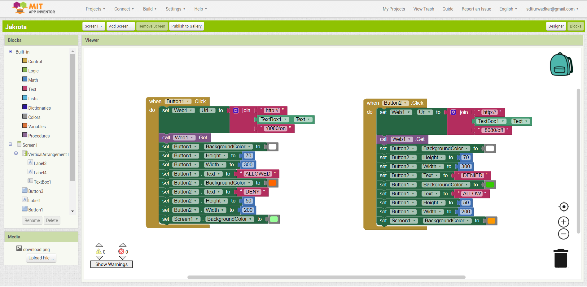
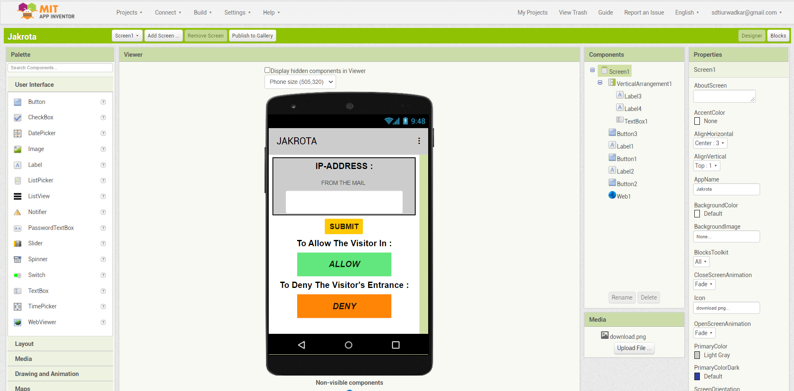

# Entrance-Management-using-IoT-Mobile-Application  
  
 We used MIT App Inventor for building Mobile Application for our Project  
 
 1. Blocks for Mobile Application
 
 
   
 2. Designer for Mobile Application  
   
    
    
 3. to download Application fork this repository and download the apk file from this repo with name Jakrota.apk
